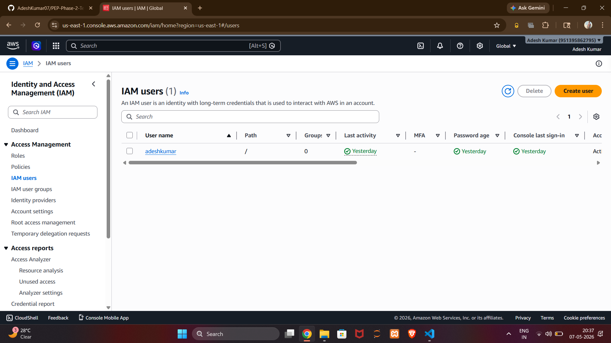
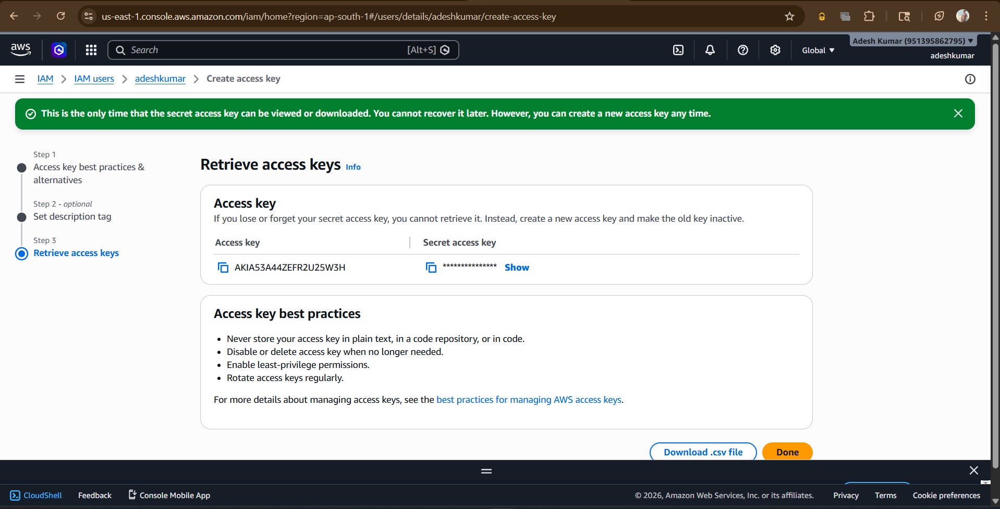
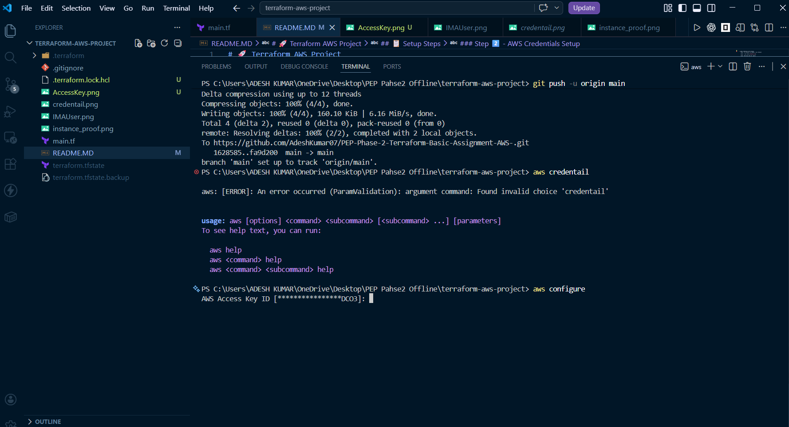

# 🚀 Terraform AWS Project

## Project Overview
This project demonstrates infrastructure as code using Terraform to provision AWS EC2 instances.

---

## 📋 Setup Steps


### Step 1️⃣ - Create Configuration
Created `main.tf` with HCL code for AWS infrastructure

### Step 2️⃣ - AWS Credentials Setup
- Created IAM user


- For Generated access credentials
  Login as root user 
  step1- Go on IAM user and click on that 

  step2- & click on Generate Key 
    
  and proceed with next step 


- Linked credentials with terminal
    step1 - In terminal run command : aws configure

    step2 - 
            
    step4 - AWS Access Key ID: (paste)
            AWS Secret Access Key: (paste)
            Default region: ap-south-1
            Default output format: json

    step5 - fill these things 

### Step 3️⃣ - Initialize Terraform
```bash
terraform init
```

### Step 4️⃣ - Plan Infrastructure
```bash
terraform plan
```

### Step 5️⃣ - Apply Configuration
```bash
terraform apply
``` 
PS C:\Users\ADESH KUMAR\OneDrive\Desktop\PEP Pahse2 Offline\terraform-aws-project> terraform apply

  

aws_instance.my_instance: Creating...
aws_instance.my_instance: Still creating... [00m10s elapsed]
aws_instance.my_instance: Creation complete after 15s [id=i-0e5a6bc5a6a457b02]

Apply complete! Resources: 1 added, 0 changed, 0 destroyed.

Outputs:

instance_public_ip = "13.206.237.146"
& also verfiy in the instance_proof.png 


step5 to aviod cost 
terraform destroy   to stop the EC2 machine 


> ⚠️ **Important:** Due to the large size of the folder, I have committed only the essential/important files. Please review or request additional files if needed.